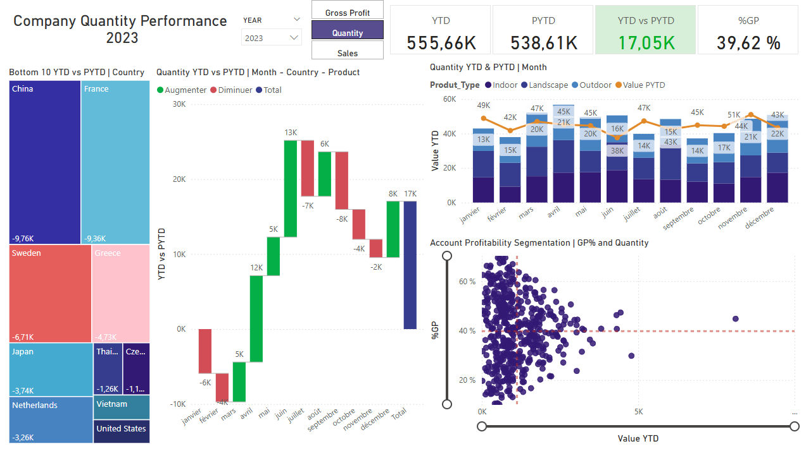

# Analyse de la performance des ventes – Tableau de bord Power BI

## Présentation du projet
Ce projet consiste en la création d’un **rapport de performance des ventes dynamique** avec Power BI, intégrant des fonctionnalités avancées pour offrir une analyse claire et interactive.  

### Objectifs clés
- Analyser le **Chiffre d’affaires (CA)**, la **Quantité vendue** et la **Marge brute**  
- Permettre une navigation intuitive entre différents indicateurs grâce aux mesures dynamiques  
- Mettre en évidence les valeurs critiques via le **formatage conditionnel**  

---

## Données & Méthodologie

1. **Sources de données** :  
   - Table des transactions de ventes (table de faits)  
   - Dimensions : Produit, Client, Temps  

2. **Processus ETL** :  
   - Nettoyage, transformation et modélisation (Power Query)  
   - Schéma en étoile (Faits & Dimensions)  
   - Création des **mesures DAX** principales :
     - CA total  
     - Quantité vendue  
     - Marge brute  
     - Taux de marge %  
     - Mesures dynamiques pour basculer entre indicateurs (CA / Quantité / Marge)

3. **Formatage conditionnel** :  
   - Application de règles visuelles (couleurs, icônes) selon seuils définis (ex. : marge faible en rouge)  

---

## Fonctionnalités du tableau de bord
- **Slicers interactifs** : année, mois, région, produit  
- **Mesures dynamiques** : choix de l’indicateur affiché selon le contexte  
- **Visuels dynamiques** :
  - Tendances (CA, Marge dans le temps)  
  - Top/Flop produits  
  - Carte géographique des ventes  
  - KPIs synthétiques  

- **Formatage conditionnel** : mise en valeur des données critiques  

---

## 🖼️ Aperçu du tableau de bord

