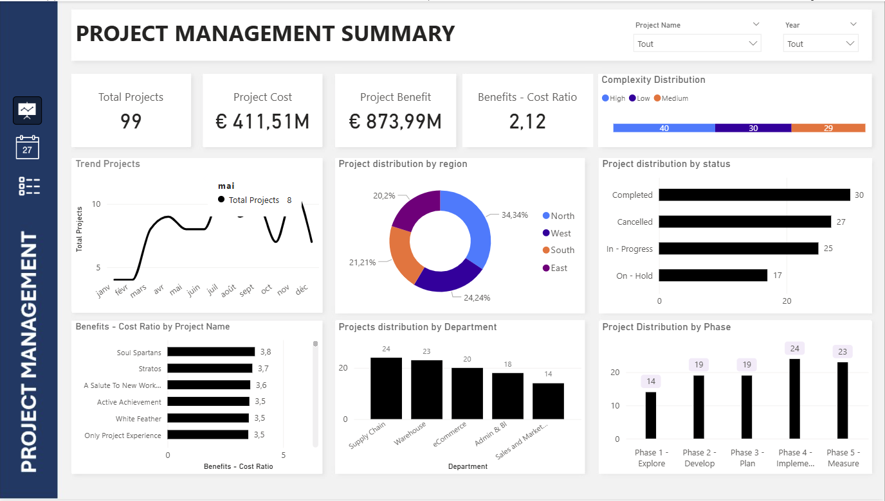
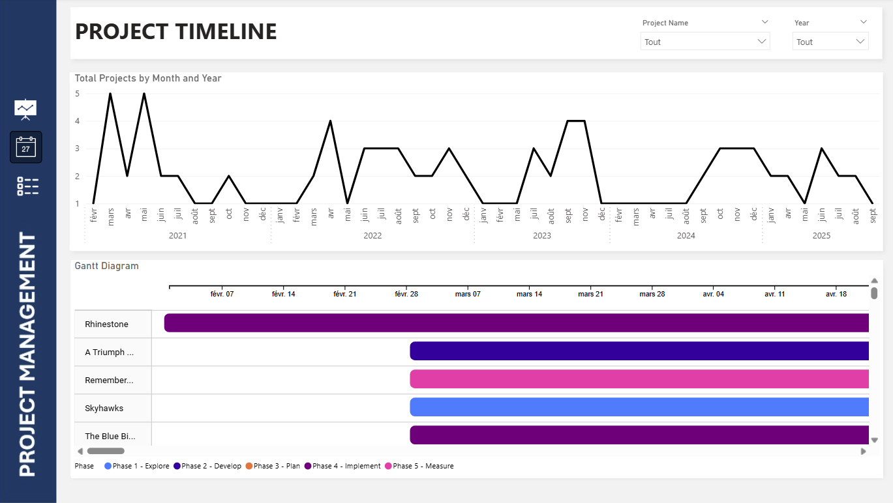
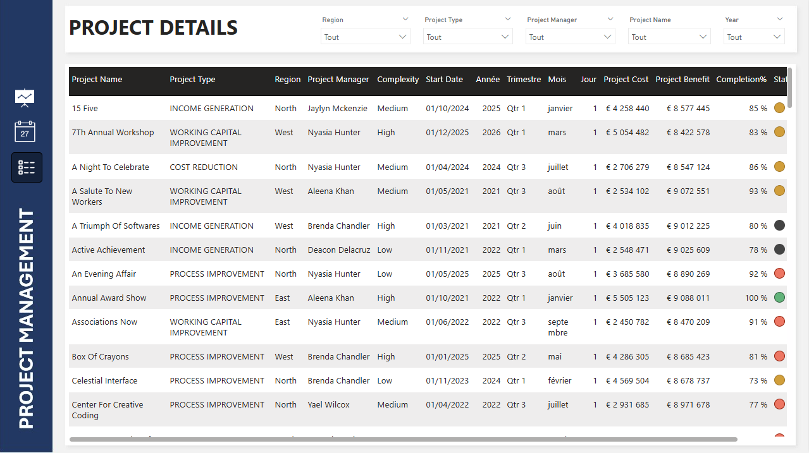

# 📊 Power BI — Project Management Dashboard (3 pages)

> Tableau de bord Power BI professionnel pour le suivi de portefeuille projets (3 pages) : **Project Summary**, **Project Timeline (Gantt)**, **Project Detail**.  
> Construit de A à Z : Power Query (nettoyage), modèle de données optimisé, mesures DAX, Gantt interactif, boutons de navigation personnalisés et fonds créés via PowerPoint.

---

## 🔎 Objectif

- Centraliser le pilotage des projets (coûts, bénéfices, état d’avancement, priorisation).  
- Fournir des insights actionnables par région, département, statut et phase.  
- Démontrer des compétences Power BI avancées (DAX, Power Query, design et UX).

---

## ✅ Pages & fonctionnalités

### 1. Project Summary
- KPIs : **Total Projects**, **Total Cost**, **Total Benefits**, **Benefit-Cost Ratio**  
- Segmentation par **Region / Department / Status / Phase**  
- Visuels : cartes, bar chart, doughnut, line chart  

---

### 2. Project Timeline
- **Gantt chart** pour start / end dates  
- Line chart : projets par mois/année   

---

### 3. Project Detail
- Table interactive avec filtres  
- **Formatage conditionnel** : Completed / On Hold / Canceled / In Progess  
- Exploration par slicers  

---

## ⚙️ Stack technique

- **Power BI Desktop**  
- **Power Query (M)** : nettoyage et transformation  
- **DAX** : mesures dynamiques (Date Table, KPIs, % Completion)  
- **Visuel téléchargé** : Gantt chart  
- **Design** : fonds créés dans PowerPoint + navigation par icônes  

---

## /data-analysis-project-management-powerbi-project/

- /data/                                            # Données sources csv
- project_management_dashboard.pbix                 # Fichier Power BI
- /img/                                             # Captures d’écran des dashboards et icones
- /dashboard_background/                            # Backgrounds PowerPoint
-  README.md                                        # Documentation du projet
